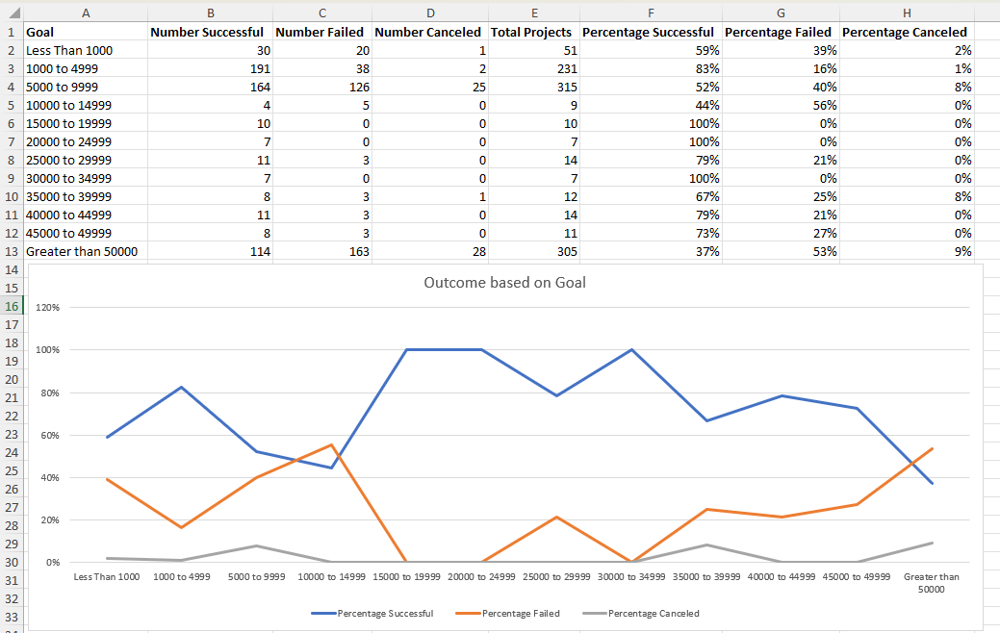

# crowdfunding analysis

Crowdfunding platforms like Kickstarter and Indiegogo have been growing in success and popularity since the late 2000s. From independent content creators to famous celebrities, more and more people are using crowdfunding to launch new products and generate buzz, but not every project has found success.

To receive funding, the project must meet or exceed an initial goal, so many organizations dedicate considerable resources looking through old projects in an attempt to discover “the trick” to finding success.

My task was to  organize and analyze a database of 1,000 sample projects to uncover any hidden trends.

* Using the Excel workbook, I modified and analyzed the sample-project data and try to uncover market trends.
  * I used the conditional formatting to fill each cell in the outcome column with a different color, depending on whether the associated campaign was successful, failed, canceled, or is currently live.

  

  * I created two new columns, one called Parent Category and another called Sub-Category, that use formulas to split the Category and Sub-Category column into the two new, separate columns.
* Parent Category
     * I created a new sheet with a pivot table that analyzed my  initial worksheet to count how many campaigns were successful, failed, canceled, or are currently live per category.
     * I created a stacked-column pivot chart that can be filtered by country based on the table that I created.

    

* Sub-Category
    * I created a new sheet with a pivot table that analyzed my initial sheet to count how many campaigns were successful, failed, or canceled, or are currently live per sub-category.
    * I created a stacked-column pivot chart that can be filtered by country and parent category based on the table that I created.

    

* I created a new sheet with a pivot table that has a column of outcome, rows of Date Created Conversion, values based on the count of outcome, and filters based on parent category and Years.
* I created a pivot-chart line graph that visualized the new table

# Crowdfunding Goal Analysis

* Using the COUNTIFS() formula, I counted how many successful, failed, and canceled projects were created with goals. I populated the Number Successful, Number Failed, and Number Canceled columns with these data points.

* I added up each of the values in the Number Successful, Number Failed, and Number Canceled columns to populate the Total Projects column. Then, used a mathematical formula, to find the percentage of projects that were successful, failed, or canceled per goal range.

* I created a line chart that graphs the relationship between a goal amount and its chances of success, failure, or cancellation.

# Statistical Analysis
* I created a new worksheet in my workbook, and created one column for the number of backers of successful campaigns and one column for unsuccessful campaigns.
* I used Excel to evaluate the following values for successful campaigns, and then did the same for unsuccessful campaigns:
   * The mean number of backers
   * The median number of backers
   * The minimum number of backers
  * The maximum number of backers
   * The variance of the number of backers
   * The standard deviation of the number of backers

* I used the data to determine if there is more variability with successful or unsuccessful campaigns

